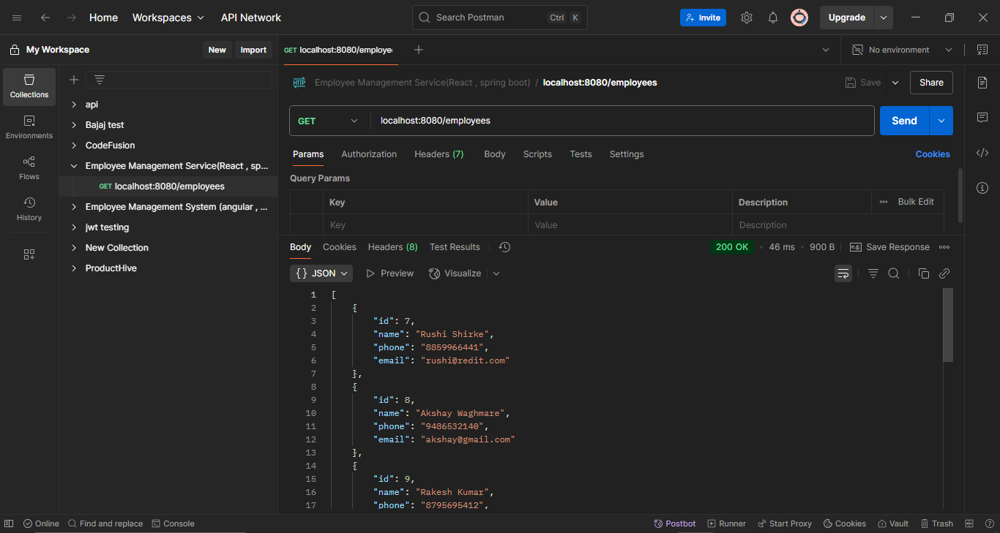
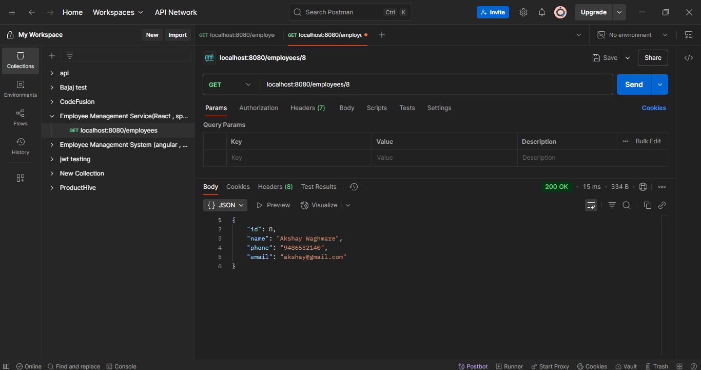
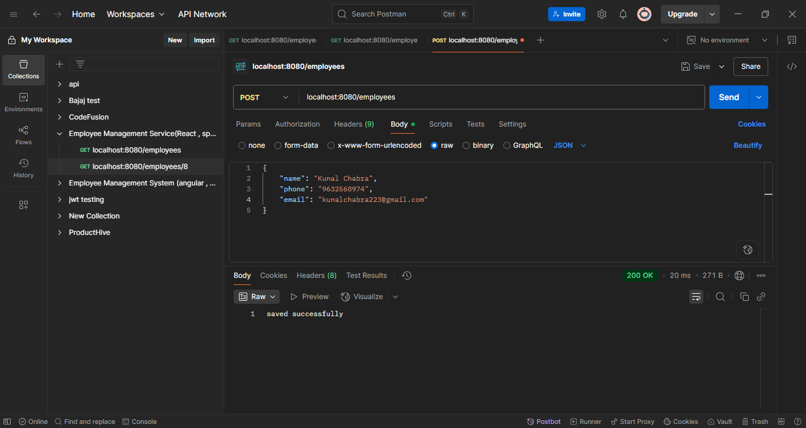
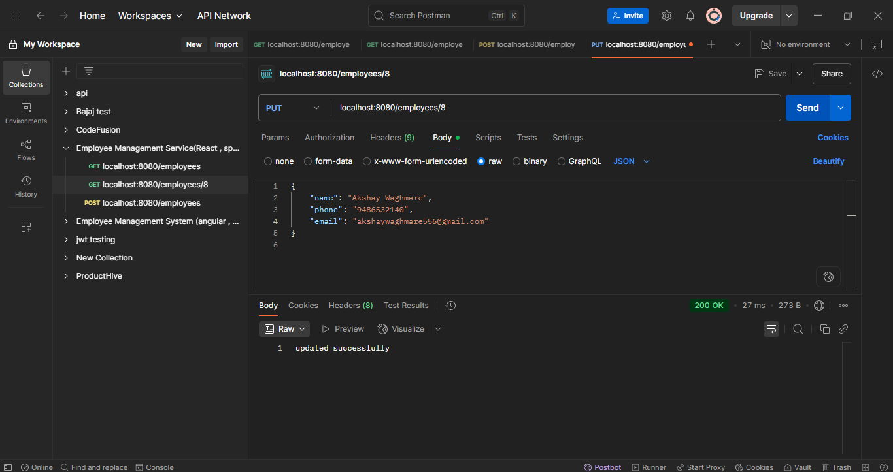
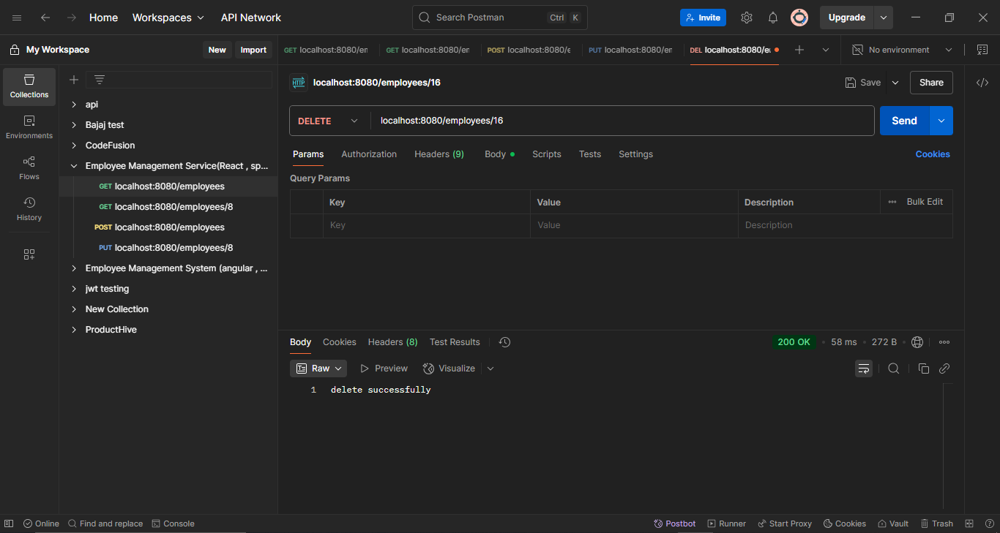
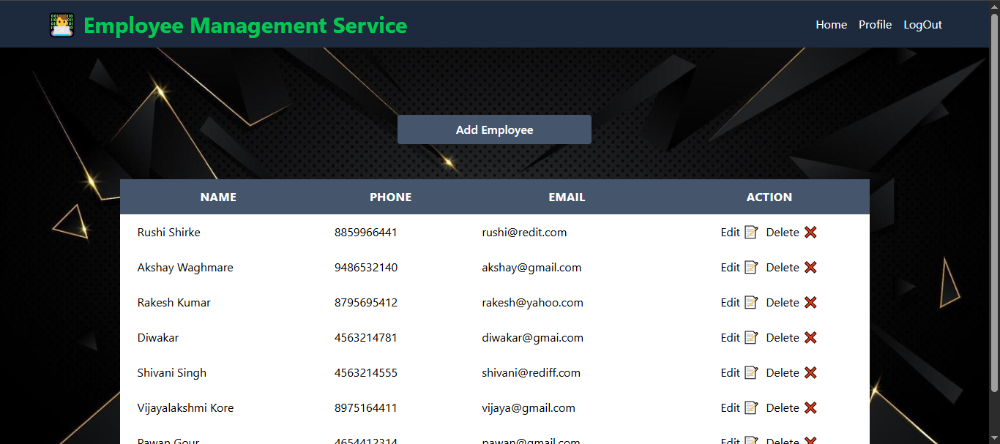
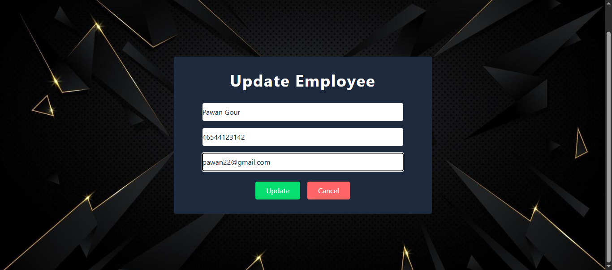

# 👨‍💼 Employee Management Service
A full-stack Employee Management CRUD application developed using **Spring Boot** for the backend, **React.js with Vite** for the frontend, and **MySQL** as the database. All API endpoints are tested using **Postman**.

This project is a basic Employee Management Service that allows users to add, view, update, and delete employee records.  
The backend is built using Spring Boot, while the frontend is developed using React. API functionalities are tested through Postman.

📌 Note: In future updates, Spring Security with JWT will be implemented for secure login functionality.
## ✨ Features

- Add new employee
- View all employees
- Update employee details
- Delete an employee
- RESTful APIs tested with Postman
- React-based frontend interface (basic UI)

🔐 Future Scope:
- Implement user authentication using Spring Security with JWT

## Screenshots

[📸 Postman API Screenshots]

### 🔹 Get All Employees

### 🔹 Get One Employee

### 🔹 Add Employee

### 🔹 Update Employee

### 🔹 Delete Employee

[📸 Website Screenshots]

### 🔹 Get All Employees

### 🔹 Add Employee

### 🔹 Update Employee

## 🚀 How to Run the Project

### 🔧 Backend (Spring Boot)
1. Clone the repository.
2. Open the Spring Boot project in your IDE.
3. Configure `application.properties` with your MySQL database credentials.
4. Run the Spring Boot application.

### 🌐 Frontend (React)
1. Navigate to the React project folder.
2. Run `npm install` to install dependencies.
3. Run `npm run dev` to start the frontend on `http://localhost:5173`.

### 🧪 API Testing
- APIs can be tested using Postman.
- Default backend URL: `http://localhost:8080/api/employees`
## 🛠️ Technologies Used

- Java Spring Boot
- React.js with Vite
- MySQL
- Postman
- RESTful API
